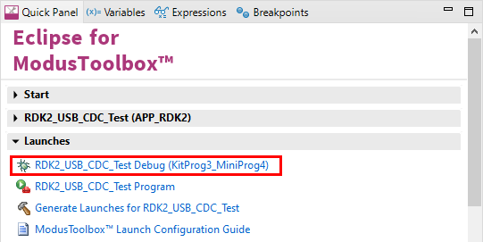

# RDK2 USB CDC Test Example

Rutronik Development Kit Programmable System-on-Chip CY8C6245AZI-S3D72 "USB Communications Device Class" Example. 

This example is used for testing the USB port and demonstrates the CDC device software features.

 

## Requirements

- [ModusToolbox® software](https://www.infineon.com/cms/en/design-support/tools/sdk/modustoolbox-software/) v3.0

### Using the code example with a ModusToolbox IDE:

1. Import the project: **File** > **Import...** > **General** > **Existing Projects into Workspace** > **Next**.
2. Select the directory where **"RDK2_USB_CDC_Test"** resides and click  **Finish**.
3. Update libraries using  a **"Library Manager"** tool.
4. Select and build the project **Project ** > **Build Project**.

### Operation

This example is used to test the USB peripheral. All the characters sent to the CDC port will be echoed back. 

### Debugging

If you successfully have imported the example, the debug configurations are already prepared to use with a the KitProg3, MiniProg4, or J-link. Open the ModusToolbox perspective and find the Quick Panel. Click on the desired debug launch configuration and wait until the programming completes and debugging starts.

## Legal Disclaimer

The evaluation board including the software is for testing purposes only and, because it has limited functions and limited resilience, is not suitable for permanent use under real conditions. If the evaluation board is nevertheless used under real conditions, this is done at one’s responsibility; any liability of Rutronik is insofar excluded. 

